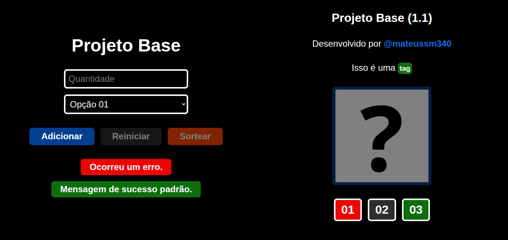
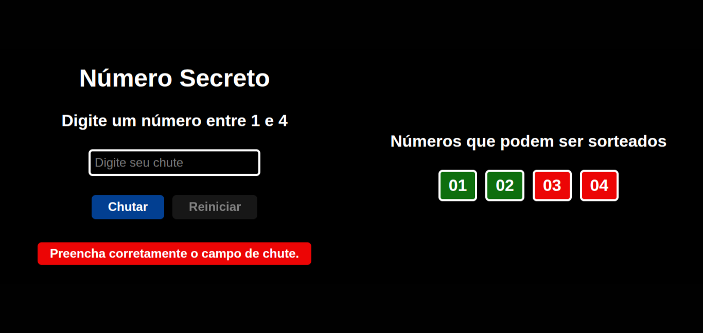
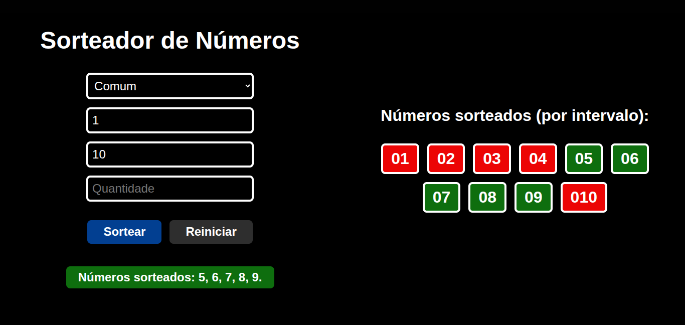
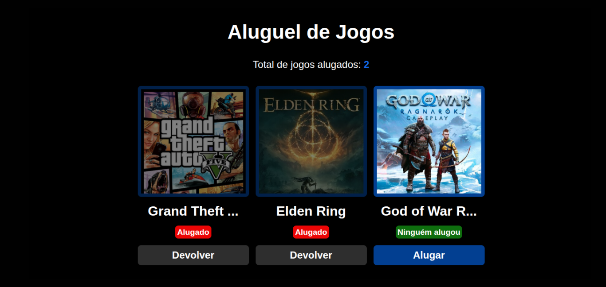
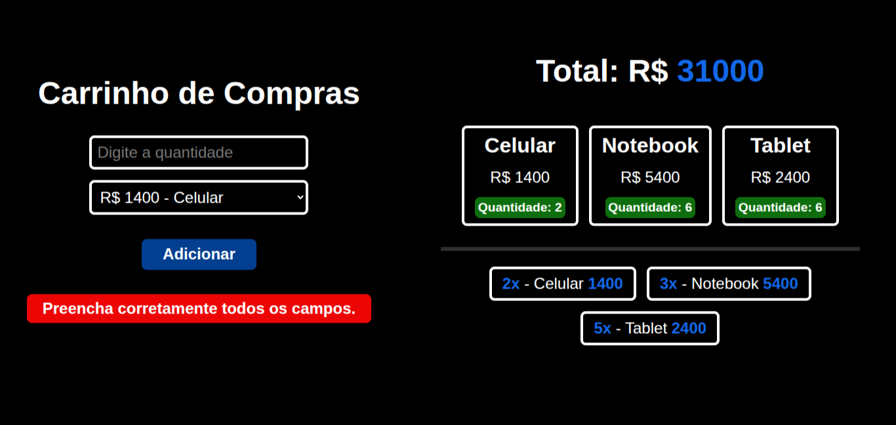
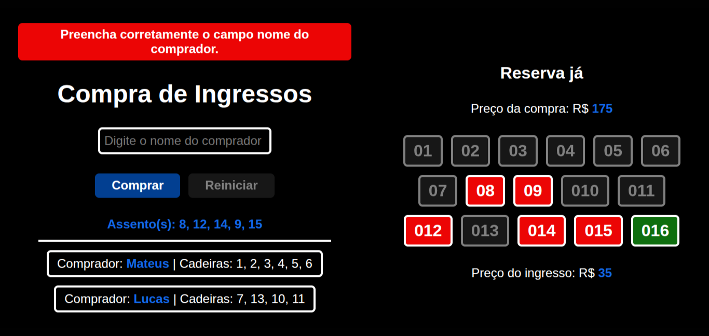
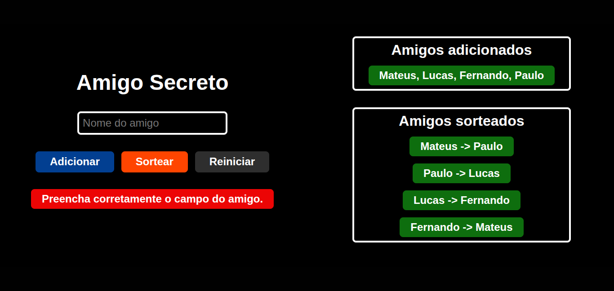

# Challenges Logic Programming

## About

Project list:

- [x] Base Project.
- [x] Secret Number.
- [x] Number picker.
- [x] Game rental.
- [x] Shopping cart.
- [x] Ticket purchase.
- [x] Secret Santa.

[Deploy](https://challenges-logic-programming.netlify.app/)

|Base Project|Secret Number|Number Picker|Game Rental|
|------------|--------------|--------------------|----------------|
|||||
|Shopping Cart|Ticket Purchase|Secret Santa
||||

## Meta

### 1. Starting from Scratch: Beginner in Programming

- [x] Getting Started in Programming: Career and First Steps.
- [x] Programming Logic: Dive into Programming with JavaScript.
- [x] Programming Logic: Explore Functions and Lists.
- [x] Git and GitHub: Sharing and Collaborating on Projects.
- [x] Programming Logic: Practicing with Challenges.

## Contributors

Mateus Maciel, [@mateussm340](https://github.com/mateussm340)

## Licence

-x-.

> Sincerely, @mateussm340.